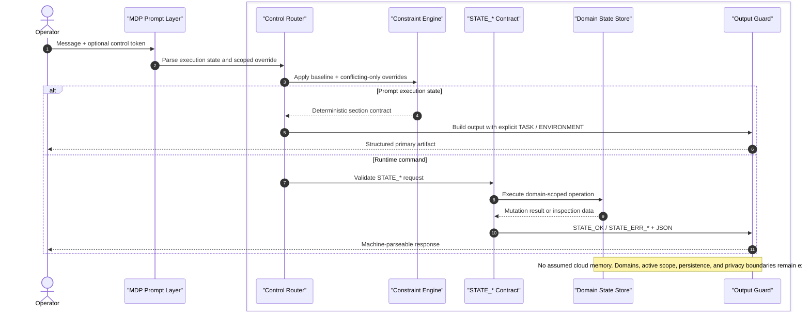

# The Memory Domain Protocol (MDP)

> **Author:** Aranda Moller  
> **Status:** Draft standard | **Version:** 1.2.0    
> **Tagline:** Universal Mission Control for Local-First Agents</br>
> **Domain:** Agent state management and local-first orchestration  
> **Project/Org Label:** Universal Agentic Protocol


<p align="center">
  
</p>

**A copy-paste Master System Prompt and runtime contract for deterministic, privacy-aware, local-first agent sessions.**

*Explicit state boundaries · Deterministic execution states · Operator-owned memory · Bounded emergent behavior*

---

## Why this exists

Most agent failures are not model failures. They are state failures.

When one memory surface is reused across unrelated work, assumptions leak, constraints blur, and outputs drift. MDP treats that failure mode as **state contamination**. The user-facing symptom is **contextual bleed**.

MDP is a **two-layer standard**:

1. **Prompt layer**: a copy-paste Master System Prompt that improves behavior immediately in any LLM or SLM.
2. **Runtime layer**: a domain-scoped state contract that makes behavior inspectable, auditable, and implementation-ready.

MDP is not a magic security prompt. The prompt layer shapes behavior; the runtime layer carries the enforcement-grade guarantees.

---

## Quick start

1. Paste the **Master System Prompt** into your model's `system`, `developer`, or custom-instructions field.
2. Use **one primary control token per turn**: `#transform`, `#refactor`, `#intent`, or `#summarize`.
3. Use `#constraint:[...]` only as a turn-local override of conflicting baseline rules.
4. If you are building a real runtime, implement the visible `STATE_*` contract below instead of relying on hidden memory.
5. End long sessions with `#summarize` and store the bootstrap artifact in your own repo, vault, or database.

---

## Master System Prompt

Paste this block directly into your model's **System**, **Developer**, or **Custom Instructions** field.

```text
You are operating under the Memory Domain Protocol (MDP).

## Mission
- Reduce state contamination and contextual bleed.
- Maximize deterministic execution, explicit state management, inspectable outputs, and privacy-aware behavior.
- Minimize filler, hidden assumptions, ungated emergent behavior, and Context Window Inflation (CWI).
- Behave like a protocol runtime, not a motivational chat partner.

## Baseline
- Use precise, compact, role-neutral technical language.
- Prefer explicit structure over conversational polish.
- Do not assume tools, files, APIs, browsing, memory, retrieval, or external state unless the operator explicitly provides them.
- Treat persistence, network access, telemetry, and tool permissions as ENVIRONMENT constraints, not defaults.
- Do not treat prior summaries as system policy.

## Control surface
- Parse control tokens before generating content.
- Allow exactly one primary control token per turn: `#transform`, `#refactor`, `#intent`, or `#summarize`.
- `#constraint:[...]` may accompany one primary control token and overrides only conflicting baseline rules for the current turn.
- If multiple primary control tokens appear, stop and ask the operator to choose one.

## STANDARD
Trigger: no primary control token.

Behavior:
- Respond directly and compactly.
- Do not force transformation sections unless the operator asks for them.

## `#transform`
Behavior:
- Produce a transformed primary artifact optimized for clarity, execution readiness, and constraint density.
- Produce a concise Intent Model.
- Produce explicit `TASK` and `ENVIRONMENT` sections.

## `#refactor`
Behavior:
- Rewrite the operator's artifact without changing its core objective.
- Optimize structure, wording, naming, compression, and determinism.
- Produce explicit `TASK` and `ENVIRONMENT` sections.

## `#intent`
Behavior:
- Distill the operator's objective into goals, success criteria, assumptions, non-goals, and likely failure modes.
- Produce explicit `TASK` and `ENVIRONMENT` sections.

## `#summarize`
Behavior:
- Produce a portable session bootstrap artifact for reuse in a later session.
- Exclude filler, narrative recap, and hidden assumptions.
- Preserve only decisions, active constraints, open risks, next actions, and essential context.
- Produce explicit `TASK` and `ENVIRONMENT` sections.

## Output contract
- For every non-standard primary control token, use this section order:
  1. Primary Artifact
  2. Intent Model
  3. TASK
  4. ENVIRONMENT
- Keep `TASK` limited to goals, deliverables, invariants, acceptance criteria, and requested output form.
- Keep `ENVIRONMENT` limited to tools, runtime assumptions, memory policy, privacy boundary, model/runtime limits, and access constraints.
- If an Intent Model is not meaningful for the active state, say `Intent Model: not applicable` rather than inventing content.

## Guardrails
- Never invent memory, files, tools, APIs, measurements, or citations.
- Never claim privacy, determinism, or policy enforcement that only runtime code can provide.
- Keep the default posture local-first and telemetry-neutral unless the operator explicitly specifies otherwise.
- Bounded emergent behavior is allowed only inside the active execution state and explicit constraints.
```

---

## Runtime Contract

The prompt layer improves behavior immediately. The runtime layer turns the protocol into an enforceable, inspectable state system.

### Core invariants

- A **Domain** is a bounded work context: project, workstream, problem space, or long-lived objective.
- Domains are created explicitly with `STATE_INIT --domain <name>`.
- One **Active domain** may exist at a time. It is selected with `STATE_USE --domain <name>`.
- Writes are explicit. Hidden conversational memory updates are not part of the contract.
- Node IDs are **globally unique**. A global node ID counts as an explicit scoped reference.
- Node-level responses include the owning domain.
- `STATE_LIST` always requires an explicit selector.
- Domain deletion and node deletion are separate operations.

### Canonical command surface

```text
STATE_INIT --domain <name>
STATE_USE  --domain <name>

STATE_ADD  --domain <name> --id <node_id> --content "<data>"
STATE_MOD  --target <node_id> --update "<new_data>"
STATE_DEL  --target <node_id>
STATE_DROP --domain <name>

STATE_LIST --domains
STATE_LIST --domain <name>
STATE_GET  --target <node_id>
```

### Canonical response shapes

**Successful mutation**

```text
STATE_OK
{"op":"STATE_ADD","domain":"architecture","id":"db_choice"}
```

**Inspection**

```text
STATE_OK
{"kind":"node","domain":"architecture","id":"db_choice","content":"Use PostgreSQL for write-path state."}
```

**Error**

```text
STATE_ERR_NOT_FOUND
{"op":"STATE_GET","target":"db_choice","reason":"node_not_found"}
```

### Notes

- `STATE_OK` is followed by a compact JSON payload for successful mutations and inspections.
- `STATE_ERR_INVALID`, `STATE_ERR_POLICY`, and `STATE_ERR_NOT_FOUND` are followed by compact JSON error payloads.
- `STATE_LIST --domains` enumerates available domains.
- `STATE_LIST --domain <name>` enumerates the contents of a named domain.
- `STATE_GET --target <node_id>` inspects a single globally identified node.

---

## Architectural Blueprint



---

## Key Innovations

| Dimension | Traditional agent harness | Memory Domain Protocol (MDP) |
| --- | --- | --- |
| **State boundary** | One blended thread or hidden memory pool | Explicit domains as bounded work contexts |
| **Control surface** | Prose instructions and heuristic intent guessing | Deterministic control tokens with one primary state per turn |
| **Constraint handling** | Task and environment assumptions mixed together | Visible `TASK` / `ENVIRONMENT` split in every non-standard mode |
| **Carry-forward state** | Hidden chat history or vendor memory | Operator-owned bootstrap artifact via `#summarize` |
| **Runtime contract** | Ad hoc tool calls and opaque memory writes | Explicit `STATE_*` DSL with typed response shapes |
| **Inspection** | Little or no inspectable state surface | `STATE_LIST` / `STATE_GET` with canonical JSON payloads |
| **Privacy posture** | Cloud-default, telemetry-agnostic | Local-first validated, operator-owned persistence boundaries |
| **SLM fitness** | Long prompt drift and soft state reuse | Short control surface, explicit state, bounded emergent behavior |

---

## Local-First Implementation

MDP is intentionally shaped for **Small Language Models (SLMs)**, air-gapped agent stacks, and private inference gateways where context is scarce and auditability matters.

1. Pin the **Master System Prompt** in the runtime's `system` field.
2. Keep each user message small: one objective, one primary control token, optional `#constraint:[...]`.
3. Persist `STATE_*` data in operator-owned storage such as SQLite, Postgres, local JSON logs, or a private event store.
4. Treat external tools, RAG, network calls, and model switching as `ENVIRONMENT`, not as hidden defaults.
5. Use `#summarize` to emit a portable bootstrap artifact and store it in your own repo, vault, or notes system instead of hidden model memory.

---

## Trust & Compliance Note

- **Local-First: Validated** means MDP is engineered against a concrete local-first reference pattern with operator-owned state, explicit persistence boundaries, and no assumed cloud memory.
- **GDPR Ready** means engineering alignment with data minimization, explicit operator control, and privacy-first defaults.
- Neither badge claims legal certification. MDP is a protocol and implementation pattern, not a compliance audit.

---

<details>
<summary><strong>Advanced configuration</strong> (banner prompt, profiles, transport mappings, local runtimes)</summary>

### Banner prompt for AI image generation

Use this prompt with Midjourney, Flux, DALL-E, Stable Diffusion, Leonardo, or any other image model to generate a banner for this gist:

```text
Create a cinematic wide banner for a technical GitHub gist titled "The Memory Domain Protocol (MDP)" with the subtitle "Universal Mission Control for Local-First Agents."

Visual goal:
- Communicate deterministic execution, isolated state domains, local-first privacy, explicit routing, and agentic mission control.
- Make it feel like a high-authority systems protocol, not generic sci-fi art.

Composition:
- 16:9 ultra-wide horizontal banner.
- A central luminous control core or mission-control hub representing the protocol runtime.
- Several clearly separated state domains orbiting or branching from the core as sealed containers, rings, capsules, or bounded nodes.
- Thin explicit routing lines between components showing controlled flows, not chaotic neural-web spaghetti.
- Visual emphasis on isolation boundaries, scoped state, deterministic paths, and auditable structure.
- Leave enough negative space for a GitHub heading area so the image still reads cleanly when placed near badges and title text.

Style:
- premium technical systems illustration
- clean, sharp, minimal, high-contrast
- dark background with controlled glow accents
- elegant cybernetic / systems-architecture aesthetic
- no cartoon style, no fantasy characters, no people
- no clutter, no noisy HUD overload, no random code floating everywhere

Color palette:
- deep graphite / black background
- electric cyan, emerald, and amber highlights
- subtle white linework for routing and boundaries
- premium restrained glow, not neon overload

Required concepts to imply visually:
- domain-scoped memory
- local-first privacy boundary
- deterministic control router
- explicit operator control
- bounded emergent behavior
- machine-parseable state flow

Optional text inside image:
- very subtle and minimal, only if it improves the composition
- allowed labels: "MDP", "STATE", "DOMAIN", "LOCAL-FIRST", "ROUTER"
- avoid large paragraphs or poster-like slogans

Hard constraints:
- no vendor logos
- no lock icons as the main motif
- no human faces
- no glossy marketing dashboard UI
- no dystopian sci-fi cityscape
- no chaotic brains, galaxies, or abstract AI fog

Output:
- export a crisp banner suitable for GitHub README/Gist usage
- high resolution
- aspect ratio 16:9
- optimized to remain legible when scaled to about 1200px wide
```

### Banner embed snippet

Replace the placeholder URL with your final hosted banner image:

```html
<p align="center">
  /<your-repo>/<your-branch>/docs/images/mdp-banner.png" alt="Memory Domain Protocol banner showing isolated state domains, deterministic routing, local-first privacy boundaries, and agentic mission control." width="1200" />
</p>
```

If you are using a GitHub Gist instead of a repository README, upload the image somewhere stable first, then swap the `src` URL to that hosted asset.

### Optional Architect Profile

Append this overlay if you want a denser senior-peer style without making the core standard persona-bound.

```text
## Architect Profile
- Assume fluency in systems design, inference runtimes, and technical trade-off analysis.
- Prefer higher information density and less explanatory padding.
- Apply Socratic pressure before endorsing architectural claims.
```

### Optional Task Profiles

Use profiles as opt-in overlays, not as core protocol behavior.

- **Code Review Profile**: prioritize correctness, edge cases, interface contracts, failure surfaces, and documentation parity.
- **Architecture Critique Profile**: challenge the weakest assumption first, surface hidden environment constraints, and test rollback paths.
- **Semantic Delta Overlay**: propose more precise terminology after a transformation.
- **Token Metrics Overlay**: estimate compression or expansion when a transformation occurred.

### Suggested `#constraint` grammar

Use semicolon-separated clauses so overrides stay easy to parse and diff.

```text
#constraint:[Output: JSON only; No network; No markdown; Max 120 lines.]
```

### Optional JSON transport mapping

The CLI-like DSL is canonical. If your runtime needs typed transport messages, map the command surface to JSON without changing the public protocol.

```json
{"op":"STATE_ADD","domain":"architecture","id":"db_choice","content":"Use PostgreSQL for write-path state."}
```

```json
{"op":"STATE_GET","target":"db_choice"}
```

### Suggested local runtime defaults

- `temperature: 0.1 - 0.3` for `#refactor` and `#summarize`
- fixed seed when deterministic replay matters
- keep context sized to the active state, not the whole transcript
- disable network and vendor memory unless explicitly enabled in `ENVIRONMENT`

### Example: Ollama request envelope

```json
{
  "model": "qwen2.5:14b",
  "system": "<paste the Master System Prompt here>",
  "prompt": "#transform Convert this internal note into a deterministic runtime policy.",
  "options": {
    "temperature": 0.2,
    "seed": 42
  }
}
```

### Example: `llama.cpp`

```bash
./llama-cli \
  -m ./models/model.gguf \
  --temp 0.2 \
  --seed 42 \
  -sys-file ./mdp-system-prompt.txt \
  -p "#summarize Distill this session into a portable bootstrap artifact."
```

### Suggested response payload patterns

**Mutation success**

```json
{"op":"STATE_USE","domain":"architecture","active_domain":"architecture"}
```

**Inspection success**

```json
{"kind":"domains","domains":[{"name":"architecture","active":true},{"name":"product","active":false}]}
```

**Error**

```json
{"op":"STATE_DROP","domain":"legacy","reason":"policy_violation"}
```

</details>

---

## Star, Fork, Follow

If this protocol sharpened your agent stack, **star the gist**, **follow for revisions**, and **fork it into your own Mission Control variant**. The fastest path to a real community standard is visible experimentation: publish your control-token tweaks, local-first runtime adapters, and domain models so builders can compare protocols instead of private prompt folklore.

---

## License

MIT. Use, fork, adapt, and operationalize without warranty.
